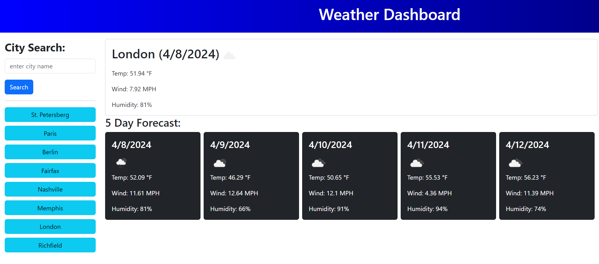

# City-Weather-Checker 

## Description

A webpage that allows you to search for the weather in various cities around the world. The most recent search results are saved, even if you close the page, as well as up to eight previous cities for faster searching.

## Table of Contents
- [Usage](#usage)
- [License](#license)
- [Contributing](#contributing)
- [Questions](#questions)

## Usage

Click on the link to go to the deployed page: [https://countduckoo.github.io/City-Weather-Checker/](https://countduckoo.github.io/City-Weather-Checker/)

Enter a city name to search for the weather in that city right now and for the next five days. Click on one of the previously searched cities to perform an updated search for weather there.

## License

This project is covered under the MIT License.

[Link to License Page](/LICENSE)

## Contributing

Feel free to contribute to this project by cloning it and making a fork. You can contact me at the email address listed below if you wish to merge the fork into the main branch.

## Questions

If you have any questions, you can reach me at one of these place(s):  

GitHub: [CountDuckoo](github.com/CountDuckoo)

Email: [countsuperc@gmail.com](mailto:countsuperc@gmail.com)
